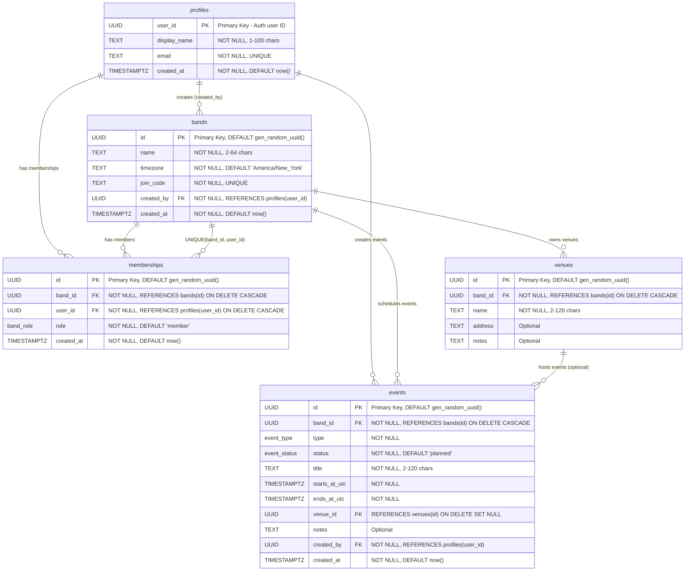

# Band Manager Database - Entity Relationship Diagram

## Database Schema Overview

This ERD represents the database structure for a band management application with user profiles, bands, memberships, venues, and events.

## Entity Descriptions

### profiles
- **Purpose**: Stores user profile information
- **Key Features**: 
  - `user_id` matches the authentication system's user ID
  - Email is unique for convenient lookups
  - Display name has length validation

### bands
- **Purpose**: Represents musical bands/groups
- **Key Features**:
  - Auto-generated UUID primary key
  - Unique join code for inviting members
  - Timezone support for scheduling
  - Created by a specific user (leader)

### memberships
- **Purpose**: Junction table linking users to bands with roles
- **Key Features**:
  - Many-to-many relationship between users and bands
  - Role-based access (leader/member)
  - Unique constraint prevents duplicate memberships
  - Cascade delete when band or user is removed

### venues
- **Purpose**: Stores venue information for events
- **Key Features**:
  - Belongs to a specific band
  - Optional address and notes
  - Cascade delete when band is removed

### events
- **Purpose**: Manages rehearsals and gigs
- **Key Features**:
  - Two types: rehearsal or gig
  - Three statuses: planned, confirmed, cancelled
  - Time validation (end > start)
  - Optional venue association
  - Tracks who created the event

## Enums

### band_role
- `leader`: Band leader with administrative privileges
- `member`: Regular band member

### event_type
- `rehearsal`: Practice session
- `gig`: Performance/show

### event_status
- `planned`: Initial state
- `confirmed`: Confirmed event
- `cancelled`: Cancelled event

## Key Indexes

- `idx_bands_name`: Fast band name searches
- `idx_memberships_user`: User's band lookups
- `idx_memberships_band`: Band member lookups
- `idx_venues_band`: Venue lookups by band
- `idx_events_band_time`: Event queries by band and time
- `idx_events_time`: General time-based event queries

## Business Rules

1. **One membership per user per band**: Enforced by unique constraint
2. **Band creators are leaders**: The `created_by` user typically gets leader role
3. **Venue ownership**: Venues belong to specific bands
4. **Event time validation**: Events must end after they start
5. **Cascade deletions**: Removing bands removes associated data
6. **Optional venues**: Events can exist without assigned venues